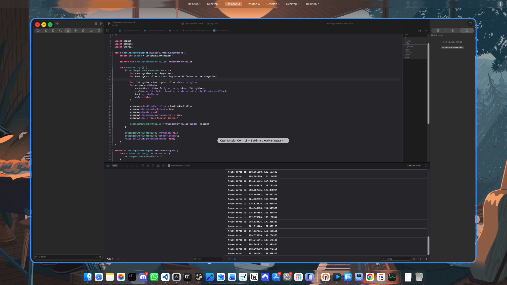

# Open Mission Control

> [!WARNING]
> This project is in a **very early stage of development**. Many features are missing, and you may encounter bugs or performance issues. Use with caution!

**Open Mission Control** is an open-source alternative to [Mission Control Plus](https://www.fadel.io/missioncontrolplus). It aims to enhance the macOS Mission Control experience by adding window management controls directly to the Mission Control view.

## Features

- **Window Overlays**: Shows a small control panel over each window in Mission Control.
- **Window Actions**:
  - **Close**: Close windows directly from Mission Control.
  - **Minimize**: Minimize windows without leaving the view.
  - **Zoom/Maximize**: Quickly resize windows.
- **Customizable Buttons**: Toggle which control buttons appear via app settings.

## Planned Features

- [ ] Installer
- [ ] App Icon
- [ ] Update Checker
- [ ] Animations for overlay
- [ ] Support for multiple monitors
- [ ] More granular settings
- [ ] Themes
- [ ] Performance optimizations

## Credits

This project stands on the shoulders of giants. Some parts of the code are borrowed from or inspired by the following amazing open-source projects:

- [ejbills/DockDoor](https://github.com/ejbills/DockDoor)
- [lwouis/alt-tab-macos](https://github.com/lwouis/alt-tab-macos)
