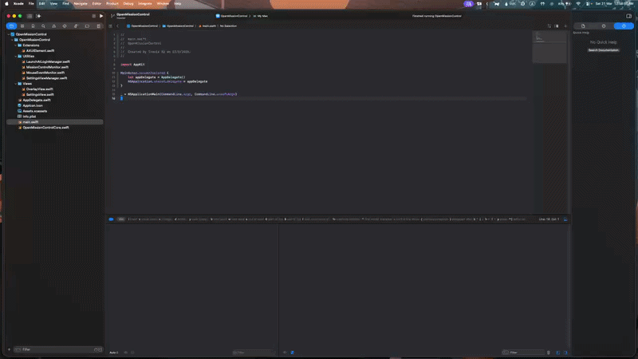

# Open Mission Control

**Open Mission Control** is an open-source alternative to [Mission Control Plus](https://www.fadel.io/missioncontrolplus). It aims to enhance the macOS Mission Control experience by adding window management controls directly to the Mission Control view.



## Features

- **Window Overlays**: Shows a small control panel over each window in Mission Control.
- **Window Actions**:
  - **Close**: Close windows directly from Mission Control.
  - **Minimize**: Minimize windows without leaving the view.
  - **Zoom/Maximize**: Quickly resize windows.
- **Customizable Buttons**: Toggle which control buttons appear via app settings.
- **Keyboard Shortcuts**: Hover over a window and use shortcuts to quickly manage it:
  - **Quit**: `⌘Q`
  - **Close**: `⌘W`
  - **Minimize**: `⌘M`
  - **Maximize/Zoom**: `⌘F`
- **Mouse Shortcuts**: Hover over a window and assign an action to either mouse shortcut:
  - **Right-click**: Minimize, Maximize, Close, Quit, or None.
  - **Middle-click**: Minimize, Maximize, Close, Quit, or None.

## Installation & Usage

### Option 1: Install via Homebrew (Recommended)

You can easily install Open Mission Control using [Homebrew](https://brew.sh/):

```bash
brew install --cask nohackjustnoobb/tap/openmissioncontrol
```

### Option 2: Manual Installation

1. Download the app from the [latest release](https://github.com/nohackjustnoobb/OpenMissionControl/releases/latest).
2. Move the app to your `/Applications` folder.
3. If macOS says the app is damaged, run the following command in your terminal to remove the quarantine flag:

```bash
sudo xattr -rd com.apple.quarantine /Applications/Open\ Mission\ Control.app
```

### First-Time Setup

1. Open the app and grant permission under **Device Control and Data Access** on macOS 27, or **Accessibility** on earlier macOS versions, when prompted in System Settings.
2. _Note: Sometimes an app restart is needed for it to function properly._

### Developer Notes

macOS manages this permission separately for the debug build and the installed app. When testing a different version, remove the previous version's entry from **System Settings > Privacy & Security > Device Control and Data Access** on macOS 27, or **Accessibility** on earlier macOS versions, before granting permission to the new version.

#### Pre-commit Hook

This repository includes a pre-commit hook that formats staged Swift files and increments the Xcode build number. Enable it after cloning with:

```bash
git config core.hooksPath .githooks
```

## Credits

This project stands on the shoulders of giants. Some parts of the code are borrowed from or inspired by the following amazing open-source projects:

- [ejbills/DockDoor](https://github.com/ejbills/DockDoor)
- [lwouis/alt-tab-macos](https://github.com/lwouis/alt-tab-macos)
